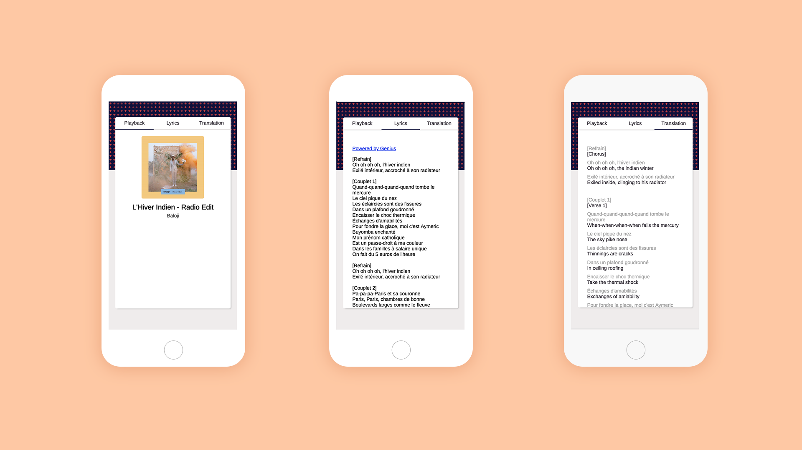

# Charo :vhs:
View and translate lyrics from your Spotify playback

## Using the Application

### Step 1/n: Creating a Spotify API Key
### Step 2/n: Creating a Genius API Key
### Step 3/n: Creating a Yandex Translate API Key
### Step 4/n: Deploying on Heroku
### Step 5/n: (Optional) Changing Language Configuration
### Step 6/n

## Contributing
